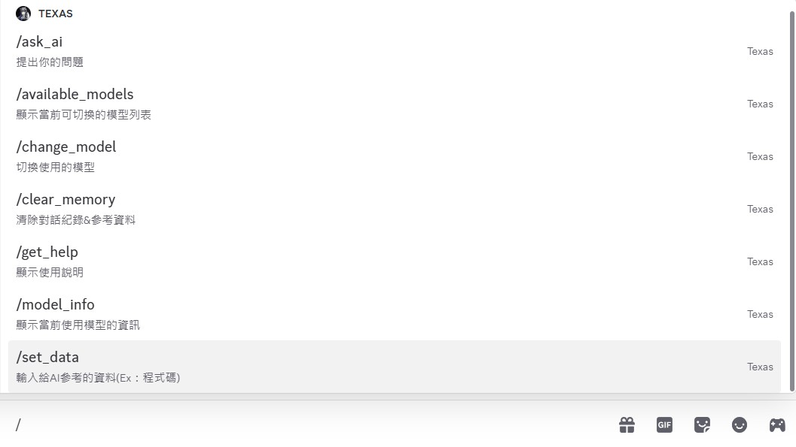

[📖 目錄](README.md) | [下一章 ➡️](第一章.md)
# **Discord-AI-Chat-Bot**
- 作者：Taiwan(R.O.C) National United University(NUU) EE U1121023
- 版本號碼：V1.19
- 創建日期：2025/05/03
- 完成日期：2025/05/22
- 更新內容：可以跳出輸入框，多行輸入

>

# **0. 目錄(點擊前往)**
1. [第一章：簡介](第一章.md)
2. [第二章：程式說明](第二章.md)
3. [第三章：簡易成果展示](第三章.md)

**Bonus**
-  [附錄A： 註冊一個Discord機器人](附錄A.md)
-  [附錄B： Nuitka： 把Python編譯成可執行的exe檔案！(限windows)](附錄B.md)
-  [附錄C： 在舊手機上執行(代替租用雲端託管服務，Android手機限定！)](附錄C.md)

[📖 目錄](README.md) | [下一章 ➡️](第一章.md)
