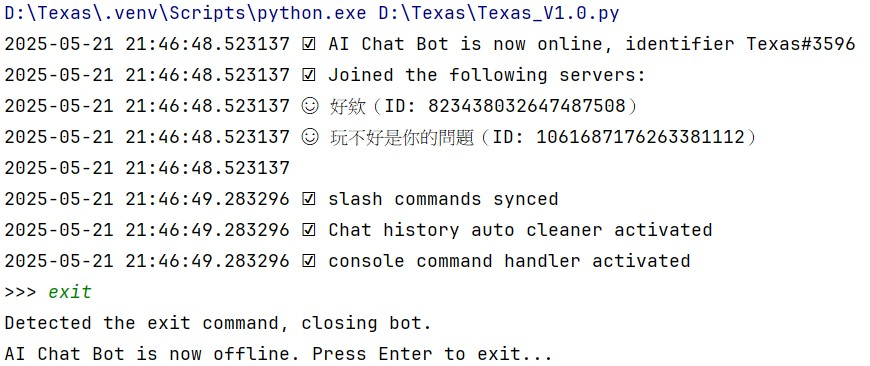
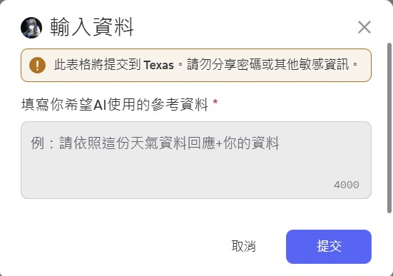
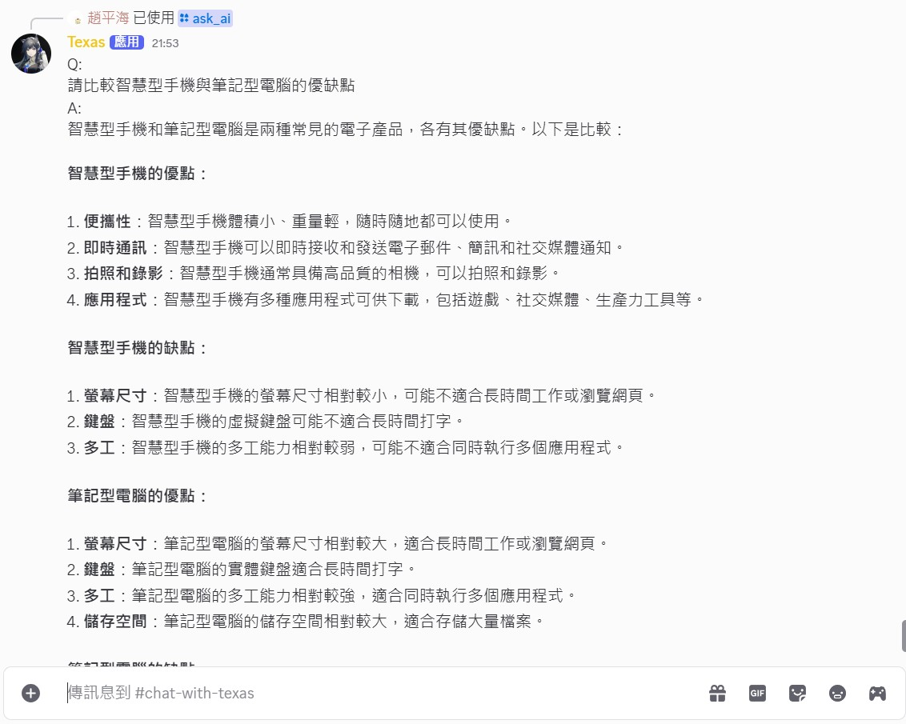
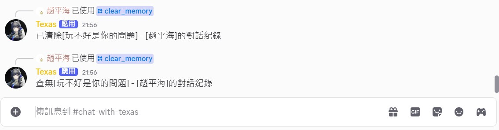
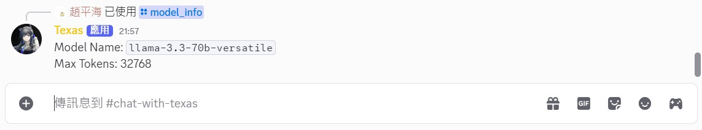
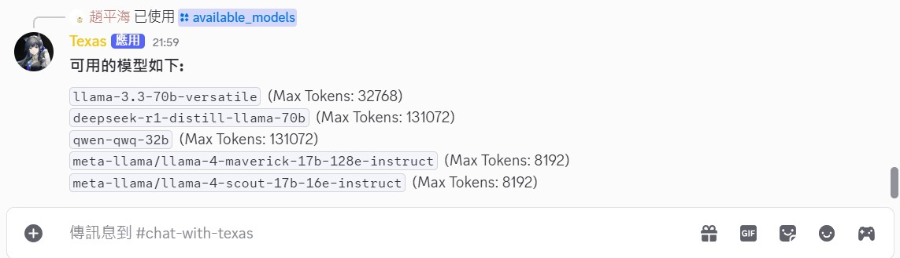
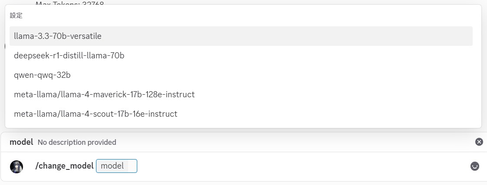
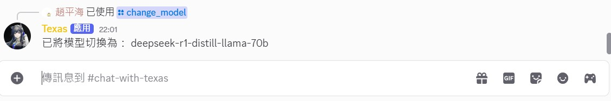
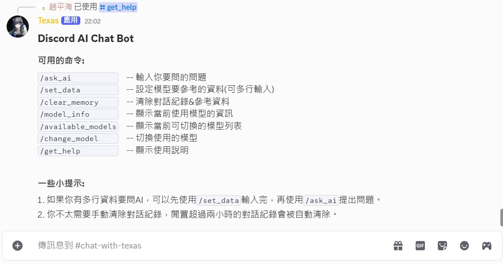

[⬅️ 上一章](第一章.md) | [📖 目錄](README.md) | [下一章 ➡️](第三章.md)
# **第二章： 程式說明**

**[💾完整的程式在此](AI_Chat_bot(可公開版本).py)**  

在說明程式之前，請先安裝好相關套件：  

開發環境：PyCharm venv(Python 3.12.7)  
使用套件：py-cord、requests  

✅ py-cord已經包含了許多類似asyncio的常用函式庫，不需額外再手動安裝  

⚠️ 由於py-cord的機器人在執行時會產生一個**無限循環的事件迴圈**，這個**事件迴圈會與Jupiter Notebook、Colab類型的程式環境互相衝突**（因為這類開發環境執行時也有自己的事件迴圈），所以使用程式碼的時候**必須在傳統的Python開發環境中執行**，才能正常運作。  
```bash
#安裝相關套件的powershell程式碼
pip install -q py-cord
pip install -q requests
```


1. 首先，先導入要使用的套件：  
	```Python
	#導入初始套件
	import discord
	import asyncio                           #clean inactive user's chat history will use this module
	from datetime import datetime,timedelta  #print time log and check inactive user's chat
	import requests                          #call Groq API
	```


2. 設定初始資料：Groq API Key、Discord Bot API Key、可用的 Groq 模型列表  
   其中，儲存使用者資料的 data 字典格式如下：  
	```python
	# 這不是程式碼，只是說明data的資料結構，變數名稱也已經修改以增進可讀性
	# 使用伺服器ID、使用者ID作為索引，可以避免使用者重名、伺服器重名的問題
	data = {
	   伺服器ID0: {
		   使用者ID0: {
			   'display_name': 使用者暱稱,
			   'last_active': 上次活躍時間,
			   'chat_history': [
				   {'role': 'user', 'content': 使用者的問題},
				   {'role': 'assistant', 'content': Groq 回應}
				],
				'guild_name': 伺服器暱稱
			},
			使用者ID1: {}
		},
		伺服器ID1: {}
	}
	```


	以下是程式碼：  
	```Python
	#設定初始資料
	Groq_api_key= '<Your Groq API Key>'
	DiscordBot_api_key= '<Your Discord Bot API Key>'
	model_list = [
	    [ 'llama-3.3-70b-versatile', 32768 ],
	    [ 'deepseek-r1-distill-llama-70b', 131072 ],
	    [ 'qwen-qwq-32b', 131072 ],
	    [ 'meta-llama/llama-4-maverick-17b-128e-instruct', 8192 ],
	    [ 'meta-llama/llama-4-scout-17b-16e-instruct', 8192 ]
	]
	model_names = [model[0] for model in model_list]  #slash command: /change_model will use this list
	model_now = model_list[0][0]                      #the default model is the first model in model_list, you can change it by using /change_model command
	max_tokens = model_list[0][1]                     #the default max_tokens is the first model's max_tokens, you can change it by using /change_model command
	data = {}                                         #all user's chat history will be stored in this dictionary
	```


3. 設定這個Discord機器人的意圖（Intents）

	因為我的機器人只會與Discord玩家伺服器互動，並且只會被斜線命令（`/slash commands`）呼叫，所以我只需要最基礎的guilds權限即可  

	值得注意的是，這個Intents同時也代表了這個機器人**訂閱了哪些Discord的服務**，也就是說，當Discord觸發了相應的事件，如果你的機器人有訂閱相應事件，就會被呼叫一次處理事件，這會造成不必要的系統資源消耗  

	✅可以的話，盡量只訂閱最低限度但必要的Intents就好  
	```Python
	#set up intents
	intents = discord.Intents(guilds=True)
	bot = discord.Bot(intents=intents)
	```


4. 自訂函式：呼叫Groq API  
	這個自訂函式接收list形式的使用者對話紀錄，並使用`request.post`方法把訊息傳給Groq API，並取得回應，將回應解析後回傳  
	```Python
	#call Groq API by requests module, messages is user's chat history
	def call_groq_api(messages):
	    url = 'https://api.groq.com/openai/v1/chat/completions'
	    headers = {'Authorization': f'Bearer {Groq_api_key}','Content-Type': 'application/json'}
	    payload = {'model': model_now,'messages': messages,'temperature': 0.6,'max_tokens': max_tokens}
	    try:
	        with requests.post(url, headers=headers, json=payload) as response:
	            response.raise_for_status()  #if http status code is not 200, raise an exception
	            return response.json()['choices'][0]['message']['content']
	    #Exception handling
	    except requests.exceptions.ConnectionError:
	        print('Network connection error')
	        return 'Network connection error, please check your internet connection'
	    except requests.exceptions.Timeout:
	        print('Request timeout')
	        return 'API request timeout, please try again later'
	    except requests.exceptions.HTTPError as e:
	        print(f'HTTP error{e}')
	        return 'HTTP error'
	    except Exception as e:
	        print(f'Unexpected error: {e}')
	        return 'Unexpected error'
	```


5. 自訂函式：不活躍對話紀錄檢查器

	這個自訂函式會被py-cord的事件迴圈循環呼叫，每隔一小時會檢查一次不活躍的對話紀錄，然後清除超過兩個小時沒使用的對話紀錄

	⚠️簡單說明一下，你不能**在走訪字典的時候刪除字典的鍵值對**，正確的做法是先建立要刪除的字典鍵清單，待走訪完目標字典後再刪除其內容  
	```Python
	#check inactive user's chat history every 3600 seconds(1 hour) and delete them if they have been inactive for more than 2 hours.
	#this function will be called by asyncio.create_task() and will run in a background thread.
	async def chat_history_auto_cleaner():
	    while True:
	        await asyncio.sleep(3600)
	        time_now = datetime.now()
	        print(f'{time_now} Checking Inactive User History...')
	        cutoff_time = time_now - timedelta(hours=2)
	        #make a copy of data avoid modifying the original data while iterating through it
	        inactive_user = []
	        for guild_id, users in data.items():
	            for user_id, user_data in users.items():
	                if user_data['last_active'] < cutoff_time:
	                    inactive_user.append((guild_id, user_id))
	                    print(f'{time_now} User {user_data['display_name']} in guild {user_data['guild_name']} has been inactive for more than 2 hours.')
	        #delete inactive user's chat history from data dictionary
	        for guild_id, user_id in inactive_user:
	            del data[guild_id][user_id]
	            if not data[guild_id]:
	                del data[guild_id]
	        print(f'{time_now} Inactive User History Cleaned.')
	```


6. 自訂函式：自訂命令行指令（exit）

	

	這個自訂函式會被py-cord的事件迴圈循環呼叫，隨時偵測console輸入的內容，如果輸入的內容包含`exit`，則安全地將機器人離線，並結束整個程式  
	```Python
	#console command handler, this function will be called by asyncio.create_task() and will run in a background thread.
	#close bot when user enter 'exit' in console.
	async def console_command_handler():
	    while True:
	        command = await asyncio.to_thread(input, '>>> ')
	        command = command.strip()
	        if 'exit' in command:
	            print('Detected the exit command, closing bot.')
	            await bot.close()
	        else:
	            print(f'Unrecognized command: {command}, please try again.')
	```  


7. 自訂類（class）：彈出式Discord表單

	

	這個表單是用來填入多行訊息的，受限於Discord slash commands只能輸入單行訊息，如果想要請AI解釋大量的內容時，複製貼上也會被阻擋。因此特地寫一個Class，當`/set_data`命令被執行時，在使用者畫面上跳出表單，**填入想要讓AI參考的資料**  

	有了參考資料，AI就不會亂答使用者的問題了  

	使用者在這裡輸入的參考資料，會被當作'system'角色資料，被存入使用者的對話紀錄，等到使用者輸入問題時，才會被一併發送給Groq API

	存入使用者對話紀錄之前，程式會先檢查使用者資料是否存在，再決定新建使用者資料，還是把資料加入既有使用者資料內。以下是程式碼：  
	```Python
	#generate a multi-line input interface in discord. this interface pops up when a user uses the /set_data command.
	class SetData(discord.ui.Modal):
	    #set up a modal interface
	    def __init__(self):
	        super().__init__(title='輸入資料')
	        self.add_item(discord.ui.InputText(label='填寫你希望AI使用的參考資料',placeholder='例：請依照這份天氣資料回應+你的資料',style=discord.InputTextStyle.long))
	    #when user click submit button, this function will be called
	    async def callback(self, interaction: discord.Interaction):
	        await interaction.response.defer()
	        system_prompt = self.children[0].value
	        #check if the user has data already
	        if interaction.guild.id in data and interaction.user.id in data[interaction.guild.id]:
	            data[interaction.guild.id][interaction.user.id]['last_active'] = datetime.now()
	            data[interaction.guild.id][interaction.user.id]['chat_history'].append({'role': 'system', 'content': system_prompt})
	        else:
	            data.setdefault(interaction.guild.id, {}).setdefault(interaction.user.id, {
	                'display_name': interaction.user.display_name,
	                'last_active': datetime.now(),
	                'chat_history': [{'role': 'system', 'content': system_prompt}],
	                'guild_name': interaction.guild.name
	            })
	        response = f'已設定AI要參考的資料：\n{system_prompt}'
	        if len(response) > 1900:
	            for i in range(0, len(response), 1900):
	                await interaction.followup.send(response[i:i+1900])
	        else:
	            await interaction.followup.send(response)
	        print(f'{datetime.now()} [{interaction.guild.name}] - [{interaction.user.display_name}]\'s Preset data has been added')
	```  

	⭐  前面的自訂程式都只是**搭配機器人運作的功能**，接下來才是機器人能夠正常運作的關鍵

	機器人成功**啟動後的動作**、**所有機器人的/slash commands**都在後面描述  


8. py-cord事件：當機器人上線(bot.event on_ready)

	這裡你可以自訂**當機器人上線後要做的動作**，簡單描述一下我這裡的設定：  
	2. 後台列印：機器人已成功上線，使用的機器人名稱為：`機器人名稱#代號`  
	3. 後台列印：機器人服務的伺服器列表  
	4. 後台行為：等待同步所有的slash commands  
	5. 註冊事件：將自動清理對話紀錄的自訂函式註冊到py-cord的事件迴圈(循環執行)  
	6. 註冊事件：將偵測後台命令`exit`的自訂函式註冊到py-cord的事件迴圈(循環執行)
 
	on_ready時的後台輸出畫面：
	

	```Python
	@bot.event
	async def on_ready():
	    print(f'{datetime.now()} ☑ AI Chat Bot is now online, identifier {bot.user}')
	    print(f'{datetime.now()} ☑ Joined the following servers:')
	    for guild in bot.guilds:
	        print(f'{datetime.now()} ☺ {guild.name}（ID: {guild.id}）')
	    print(f'{datetime.now()}')
	    await bot.sync_commands()
	    print(f'{datetime.now()} ☑ slash commands synced')
	    bot.loop.create_task(chat_history_auto_cleaner())
	    print(f'{datetime.now()} ☑ Chat history auto cleaner activated')
	    bot.loop.create_task(console_command_handler())
	    print(f'{datetime.now()} ☑ console command handler activated')
	```

9. Discord斜線命令：/ask_ai

	  
	
	這是機器人最主要也最常被使用的命令，功能是問AI問題  
	
	當鍵入`/ask_ai`後，後面有一個名為`question`的參數可輸入問題，輸入完問題後執行，機器人會把問題丟給AI並取得回應  
	
	程式的執行上，因為這個機器人具有對話記憶功能，可以跟機器人來回對話，所以執行上需要先檢查對話紀錄是否已經存在：  
	1. 對話紀錄已存在：先將使用者問題加入到對話紀錄，再將對話紀錄拿去呼叫前面提過的call_groq_api(這邊傳入使用者的對話紀錄)  
	2. 對話紀錄不存在：新增一筆使用者的資料，並把使用者的問題拿去呼叫call_groq_api( )  
	
	當取得Groq API的回傳資料後，程式會把AI的資料當作「assistant」並且紀錄到使用者的對話紀錄裡面  

	需要注意的是，Discord的每則訊息長度都有2000字元長度的限制，如果機器人發送的AI回覆超過了字數限制，則會導致發送失敗的錯誤。
	
 	解決的辦法也很簡單，只要判斷AI回覆是否超過1900字元（留一些冗餘空間），切開內容再分次發送即可。
	```Python
	@bot.slash_command(name='ask_ai', description='提出你的問題')
	async def ask_ai(ctx: discord.ApplicationContext, question: str):
	    await ctx.defer()
	    print(f'{datetime.now()} [{ctx.guild.name}] - [{ctx.author.display_name}] used command /ask_ai')
	    #check if the user has data already
	    if ctx.guild.id in data and ctx.author.id in data[ctx.guild.id]:
	        data[ctx.guild.id][ctx.author.id]['last_active'] = datetime.now()
	        data[ctx.guild.id][ctx.author.id]['chat_history'].append({"role": "user", "content": question})
	    else:
	        data.setdefault(ctx.guild.id, {}).setdefault(ctx.author.id, {
	            'display_name': ctx.author.display_name,
	            'last_active': datetime.now(),
	            'chat_history': [{'role': 'user', 'content': '請用台灣人習慣的中文回應，我的問題是：'+question}],
	            'guild_name': ctx.guild.name
	        })
	    #call Groq API and get response
	    response = call_groq_api(data[ctx.guild.id][ctx.author.id]['chat_history'])
	    data[ctx.guild.id][ctx.author.id]['chat_history'].append({"role": "assistant", "content": response})
	    #if response too long, split it into multiple messages and send them one by one
	    response = 'Q: \n'+question+'\nA: \n'+response
	    if len(response) > 1900:
	        for i in range(0, len(response), 1900):
	            await ctx.followup.send(response[i:i+1900])
	    else:
	        await ctx.followup.send(response)
	    print(f'{datetime.now()} [{ctx.guild.name}] - [{ctx.author.display_name}]\'s reply has been sent')
 	```


11. Discord斜線命令：/set_data  

 	  

  	這個指令很簡單，功能是讓使用者可以多行輸入「想要讓AI參考的資訊」  
	
	當使用者使用`/set_data`指令後，Discord畫面就會跳出前面提過的表單(class)，讓使用者可以多行輸入資料
	```Python
	@bot.slash_command(name='set_data', description='輸入給AI參考的資料(Ex：程式碼)')
	async def set_data(ctx: discord.ApplicationContext):
	    print(f'{datetime.now()} [{ctx.guild.name}] - [{ctx.author.display_name}] used command /set_data')
	    await ctx.send_modal(SetData())
	```  


12. Discord斜線命令：/clear_memory

	  

	當這個指令被觸發時，清除指令使用者的對話紀錄  

	有時候我們問問題的時候，對話Tokens會超過最大上限，如果等待兩個小時的自動清除會太慢  

	所以這裡提供一個命令，讓使用者清除自己的紀錄，再繼續問問題。  

	程式會檢查該使用者的對話紀錄是否存在，若存在，則清除；否則回傳「沒有對話紀錄可清除」
	```Python
	@bot.slash_command(name='clear_memory', description='清除對話紀錄&參考資料')
	async def clear_memory(ctx: discord.ApplicationContext):
	    await ctx.defer()
	    print(f'{datetime.now()} [{ctx.guild.name}] - [{ctx.author.display_name}] used command /clear_memory')
	    if ctx.guild.id in data and ctx.author.id in data[ctx.guild.id]:
	        del data[ctx.guild.id][ctx.author.id]
	        if not data[ctx.guild.id]:
	            del data[ctx.guild.id]
	        await ctx.followup.send(f'已清除[{ctx.guild.name}] - [{ctx.author.display_name}]的對話紀錄')
	    else:
	        await ctx.followup.send(f'查無[{ctx.guild.name}] - [{ctx.author.display_name}]的對話紀錄')
	```    


13. Discord斜線命令：/model_info

	  

	資訊提供型的斜線命令，功能是顯示目前整在使用的模型以及他的最大Tokens，被使用者觸發後立刻回傳訊息
	```Python
	@bot.slash_command(name='model_info', description='顯示當前使用模型的資訊')
	async def model_info(ctx: discord.ApplicationContext):
	    await ctx.defer()
	    print(f'{datetime.now()} [{ctx.guild.name}] - [{ctx.author.display_name}] used command /model_info')
	    await ctx.followup.send(f'Model Name: `{model_now}`\nMax Tokens: {max_tokens}\n')
	```  


14. Discord斜線命令：/available_models

	   

 	與`/model_info`類似，功能是顯示目前有哪些模型可以使用，以及這些模型可用的最大Tokens，被使用者觸發後立刻回傳訊息

	```Python
	@bot.slash_command(name='available_models', description='顯示當前可切換的模型列表')
	async def available_models(ctx: discord.ApplicationContext):
	    await ctx.defer()
	    print(f'{datetime.now()} [{ctx.guild.name}] - [{ctx.author.display_name}] used command /model_list')
	    response = '### 可用的模型如下:\n\n'
	    for name,tokens in model_list:
		response += f'`{name}`  (Max Tokens: {tokens})\n'
	    await ctx.followup.send(response)
	```    

15. Discord斜線命令：/change_model

	  
	  

 	選單式的斜線命令，可選項來自於從model_list[list]提取的model_names[list]  

  	當使用者選取完模型並送出命令後，全域變數model_now與max_tokens會被替換成指定的模型

	```Python
	@bot.slash_command(name='change_model', description='切換使用的模型')
	async def change_model(ctx: discord.ApplicationContext, model: discord.Option(str, choices=model_names)):
	    await ctx.defer()
	    print(f'{datetime.now()} [{ctx.guild.name}] - [{ctx.author.display_name}] used command /change_model')
	    global model_now, max_tokens
	    model_now = model
	    for model_name, max_tokens in model_list:
	        if model_name == model:
	            max_tokens = max_tokens
	            break
	    await ctx.followup.send(f'已將模型切換為： {model}')
	```    

16. Discord斜線命令：/get_help

	  

 	資訊提供型的斜線命令，功能是顯示一些小提示，在觸發後回傳資料

	```Python
	@bot.slash_command(name='get_help', description='顯示使用說明')
	async def get_help(ctx: discord.ApplicationContext):
	    await ctx.defer()
	    print(f'{datetime.now()} [{ctx.guild.name}] - [{ctx.author.display_name}] used command /help')
	    response = """
	## Discord AI Chat Bot
	
	### 可用的命令:
	`/ask_ai          `    -- 輸入你要問的問題
	`/set_data        `    -- 設定模型要參考的資料(可多行輸入)
	`/clear_memory    `    -- 清除對話紀錄&參考資料
	`/model_info      `    -- 顯示當前使用模型的資訊
	`/available_models`    -- 顯示當前可切換的模型列表
	`/change_model    `    -- 切換使用的模型
	`/get_help        `    -- 顯示使用說明
	
	### 一些小提示:
	1. 如果你有多行資料要問AI，可以先使用`/set_data`輸入完，再使用`/ask_ai`提出問題。
	2. 你不太需要手動清除對話紀錄，閒置超過兩小時的對話紀錄會被自動清除。
	"""
	    await ctx.followup.send(response)
	```  

17. 啟動機器人！  

	前面都是Discord機器人的功能撰寫，最後就是讓我們的機器人上線了！使用`bot.run(DiscordBot_api_key)`來讓機器人啟動  

	如果機器人成功登錄，就會去執行前面的`on_ready()`同步所有的指令到Discord上，並且在py-cord的事件迴圈內登錄我的自訂事件（自動清除記憶、後台命令exit偵測）

	當機器人結束執行後，則會在後台顯示`AI Chat Bot is now offline. Press Enter to exit...`並等待使用者按Enter離開程式

	```Python
	#run the bot
	#if you want to stop this program and make the bot offline safely, just type 'exit'.
	bot.run(DiscordBot_api_key)
	input("AI Chat Bot is now offline. Press Enter to exit...")
	```

主程式講解就到這裡  

[⬅️ 上一章](第一章.md) | [📖 目錄](README.md) | [下一章 ➡️](第三章.md)
