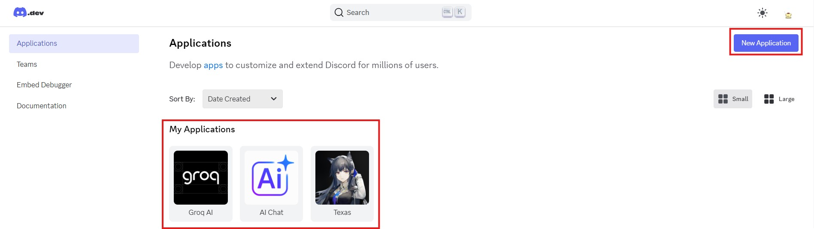
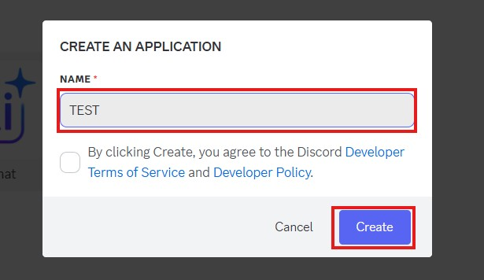
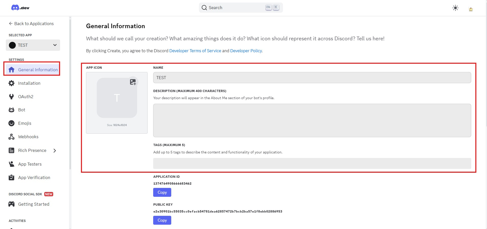
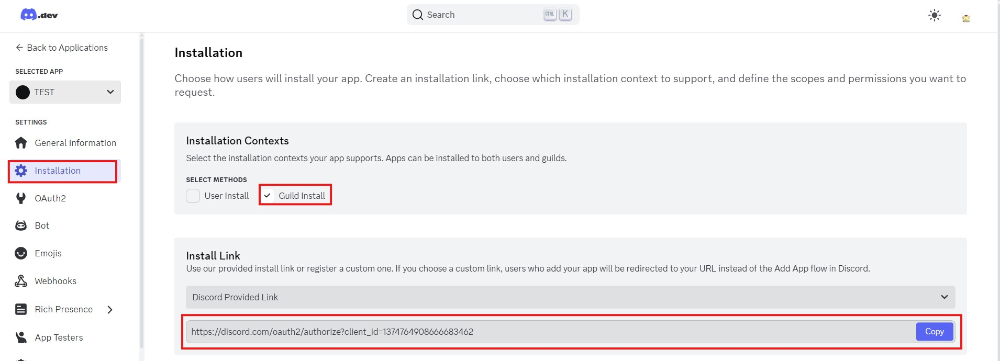
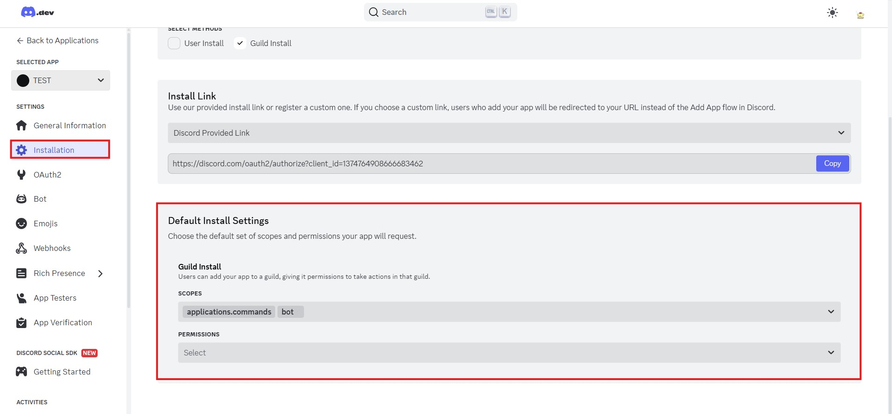
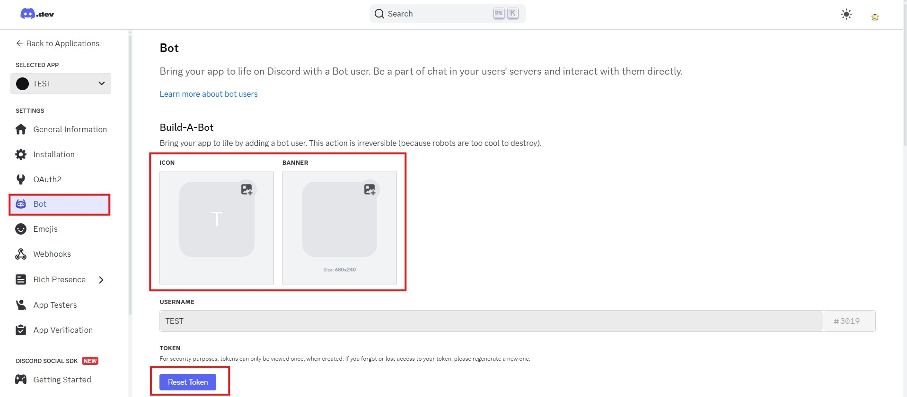

[⬅️ 上一章](第三章.md) | [📖 目錄](README.md) | [下一章 ➡️](附錄B.md)  
# **附錄A： 註冊一個Discord機器人**    
**這裡簡單的介紹如何註冊一個Discord機器人**  
1. 前往[https://discord.com/developers](https://discord.com/developers)並登入你的Discord帳號  
    >  

2. 因為我已經建立過機器人了，所以畫面不是空的，這邊示範建立一個空白的機器人，先點擊New Application按鈕，輸入機器人名稱後點擊「Create」  
    >  

3. 然後你就進入了機器人的後台了，左邊的「General Information」是設定機器人的主要外觀與描述  
    >  

4. 切換到Installation頁面，勾選Guild Install就好，確保你的機器人只服務於伺服器(如果勾選User Install也不是不行，只是寫程式要區分是User還是Guild很麻煩而已)
    
    下面的Install Link是分享機器人的關鍵，分享這個連結，就可以讓其他人邀請你的機器人到他們的伺服器  
    >  

5. 留在Installation往下捲動頁面，這裡是設定機器人可用權限的地方，機器人會使用到的權限都要先來這邊選取，在使用時機器人才不會因為權限不足而無法正常運作

    因為我的機器人只會用到Bot的斜線命令，所以我這裡單選了Bot權限，你們可以試著玩玩看其他權限

    需要注意的是，如果什麼都不選（只留application.commands），會導致使用機器人邀請連結後，機器人卻不在伺服器成員列表上的情況。

    這並不是機器人隱藏起來了，而是機器人根本沒有被成功加入。解決方法就是使用Bot權限後，再次邀請機器人到伺服器。  
    >  

6. 切換到Bot頁面，這裡是調整機器人細部設定的地方，你可以修改機器人的圖示、背景圖片...一些功能你可以試著自己發現

    注意到下面的`Reset Token`了嗎？首次建立機器人時，請大方的按下去，讓Discord產生一個Token

    這個Token是你寫程式控制機器人的關鍵，使用這個Token登入機器人，Discord才知道上線的是哪一個機器人

    所以如果這個Token不小心外洩了，請儘快來這邊按下`Reset Token`，讓有心人士沒辦法使用這個Token胡作非為  
    >  

7. 其他頁面還有其他好玩的功能，但就留給大家自己發掘。註冊一個Discord機器人就先講解到這邊。

[⬅️ 上一章](第三章.md) | [📖 目錄](README.md) | [下一章 ➡️](附錄B.md)
