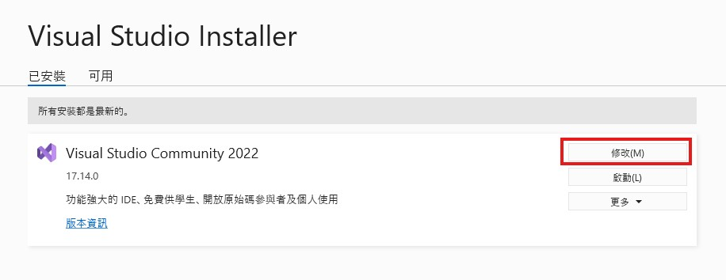

[⬅️ 上一章](附錄A.md) | [📖 目錄](README.md) | [下一章 ➡️](附錄C.md)  
# **附錄B： Nuitka：把Python編譯成可執行的exe專案！(限Windows)**  
完成機器人之後，如果每次執行都要開啟Python開發環境才能運行…土到吊渣了！   

這邊教學**如何利用Nuitka把Python程式變成高效體積小的.exe執行檔**    

預覽一下打包好的程式:D  

>  

※網路上比較常見的教學是使用PyInstaller做打包的動作，這邊我就不重複教學了，有興趣的可以去查詢`PyInstaller打包`  

# 環境準備：你需要額外安裝的東西  
你需要先安裝Visual Studio Installer這個集成開發環境。[連結在此，安裝Community版本即可](https://visualstudio.microsoft.com/zh-hant/downloads/)  

先不要感到害怕！我們只會使用到裡面的Clang編譯器以及LLVM兩個組件而已，完全不需要打開Visual Studio！  

Clang以及LLVM是用來將C語言編譯成.exe文件的編譯器  

你可能會覺得奇怪，我明明是Python程式，為什麼突然就跟C語言扯上關係了？  

其實Nuitka就是把Python轉換成C語言的工具，Nuitka會準備好執行你Python程式所需的所有依賴套件，然後再一個一個轉換成C文件  

轉換完成後，Niutka會在呼叫Clang啟動工作，再把C文件打包成.exe程式。是不是很神奇！  

看到這裡，你的Visual Studio應該也已經下載並安裝好了（應該）。請打開Visual Studio Installer，然後按下「修改」  

>  

切換到「個別元件」頁籤，在搜尋框中輸入「Clang」，然後把找到的Clang、LLVM都打勾，因為我已經安裝過了，所以右下角不會出現安裝的按鈕。總之選好後按下安裝。  

>  

安裝好Clang、LLVM後，你就再也不用打開Visual Studio了！請回到PyCharm開發環境中的PowwrShell輸入以下命令：  

```bash
pip install nuitka
```

  
>  

然後就可以使用這個命令打包你的python程式成.exe執行檔了，請在PyCharm開發環境中的PowwrShell輸入以下命令： 

```bash
nuitka --standalone --onefile --remove-output --clang --lto=yes '你的python程式名稱.py'  
```
待命令執行完成後，你的程式也就編譯好了，可以去執行看看囉！  

剛剛的神奇命令的各項參數解釋：  
- `nuitka         `：使用nuitka  
- `--standalone   `：把程式轉換成在沒有安裝Python的電腦上也能執行  
- `--onefile      `：所有的程式只能包成一個可執行文件，方便轉傳給其他人  
- `--remove-output`：編譯的過程中，會產生許多的中間文件（一些錯誤報告、蒐集的函式庫、轉換過的C文件...），這個參數可以在完成後清除這些中間文件，讓你的資料夾乾乾淨淨的！  
- `--clang        `：使用剛剛用Visual Studio安裝的Clang、LLVM進行編譯，效率高又品質好  
- `lto=yes        `：使用lto技術（鏈結時間改善），雖然會增加一些編譯的時間，可是能夠提高執行效率  

以上附錄B就先說到這裡

[⬅️ 上一章](附錄A.md) | [📖 目錄](README.md) | [下一章 ➡️](附錄C.md)  
