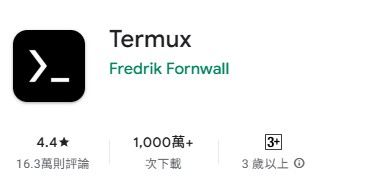
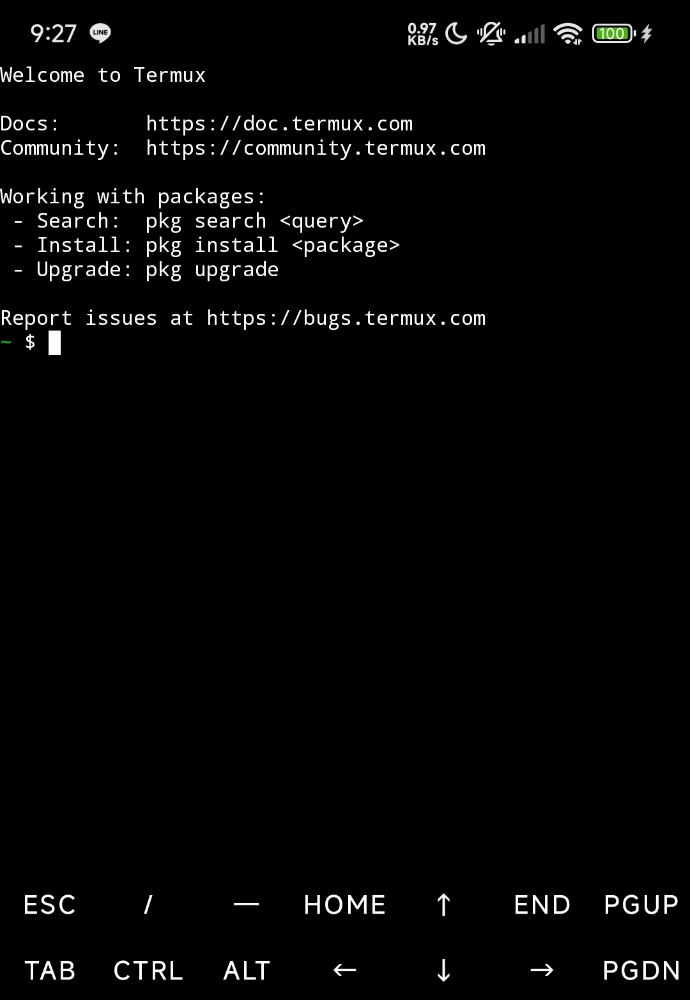

[⬅️ 上一章](附錄B.md) | [📖 目錄](README.md)
# **附錄C： 在舊手機上執行（Android手機限定！）**  
## #代替租用雲端託管服務（Termux+Python）  
### 前言  
雖然執行單一Discord機器人對電腦帶來的資源佔用幾乎可以忽略不計（非常低），但是電腦長時間運作的待機功耗也是不容小覷的  

如果你很在意電腦長時間執行Discord機器人所帶來的功耗，並且**正在尋找怎麼又省電、又能達成目標、又不用花很多錢的方法**  

這裡提供一個方案：在舊的Android手機上面執行你的Python程式！  

Android手機是一種低功耗的運算設備，但是它具備了一個完整的系統（被Google大改、精調過的Linux on Arm系統），所以如果有辦法叫出Android的終端機（類似電腦的Powershell），或是能夠透過模擬的方法執行指令，那就有機會能夠執行Python程式！  

如果你的舊手機還能運作，或是你想要在你的主力手機上面執行，這裡我會教你如何安裝一個虛擬終端機，然後在裡面安裝Python程式能夠執行的環境，最後讓你的Python程式跑起來。  

### 步驟  
1. 首先，去Google Play商店下載Termux  

    [連結在此](https://play.google.com/store/apps/details?id=com.termux)  

    >  


2. 安裝好後打開，你會看到這樣的畫面（請允許通知權限，建議去設定關閉他的省電限制，有些手機關掉螢幕就會中斷應用程式的執行與連網）：  

    >  


3. 因為是新的終端機程式，他的組件什麼都還沒安裝，所以請你執行以下命令，更新他的資料包（如果中間停下來了，輸入y然後按Enter就好了）：  
    ```bash
    pkg update && pkg upgrade -y
    ```


4. 安裝Python程式的執行環境，請執行以下命令：  
    ```bash
    pkg install python -y
    ```


5. 安裝你的Python檔案執行所需的套件。因為我的機器人只需要py-cord + requests就能執行，所以我使用這個命令：
    ```bash
    pip install py-cord
    pip install requests
    ```


6. 然後你就可以準備好你的python程式（我的是Texas_V1.0.py）把它存到手機的下載資料夾  


7. 這邊你要授予Termux存取儲存空間的權限，Termux才能讀取下載資料夾的檔案，請回到Termux繼續輸入命令：  
    ```bash
    termux-setup-storage  # 然後請同意讓Termux存取儲存空間  
    ```  


8. 開啟儲存空間後，你就可以用兩個指令一步一腳印的抵達你存放python程式的資料夾了：  
    ```bash
    ls               #這個指令負責列出當前目錄下有哪些檔案
    cd 不加任何參數   #這個命令是回到最原始的目錄
    cd 資料夾名稱     #這個命令會切換所在的目錄到你指定的資料夾名稱
    ```


9. 為了確保程式執行時關閉手機螢幕，不導致程式暫停或被停止，你還需要用這兩個指令控制是否保持喚醒(wake-on-lock)：  
    ```bash
    termux-wake-lock   #開啟保持喚醒功能
    termux-wake-unlock #關閉保持喚醒功能
    ```  


10. 找到檔案後，就可以輸入以下命令，執行你的python程式：  
    ```bash
    python 你的檔案名稱.py
    ```


11. **這時候你的程式應該就能正常運作了！！**  


12. 如果出了一些意外，你想要強制停止程式，可以在termux中按下虛擬鍵盤的`ctrl+c`，即可退出程式


13. 如果文字敘述沒辦法理解，這邊有很陽春的示範影片：
    [連結請點我](https://youtu.be/OPCT_uSLeX4)


14. 本章教學到此結束  


P.S. 如果你想要遠端控制手機，這邊提供一個方向讓你自己摸索：  
1. `被遠端操作裝置               `Termux安裝openssh,tmux
2. `被遠端操作裝置,遠端操作裝置都要`下載Tailcsale（用以建立虛擬區域網路）並啟動
3. `遠端操作裝置                 `電腦安裝MobaXterm，或者手機安裝（用來SSH連線）
4. 然後就能連上遠端裝置了
5. 詳細的資料可以去網路上查資料或是問AI，這個方法留給想要進階操作的人自己練習

[⬅️ 上一章](附錄B.md) | [📖 目錄](README.md)
